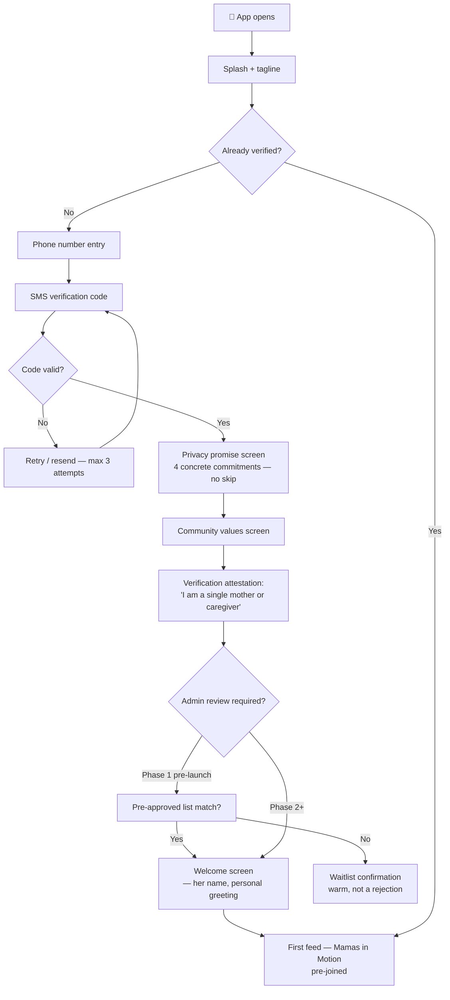
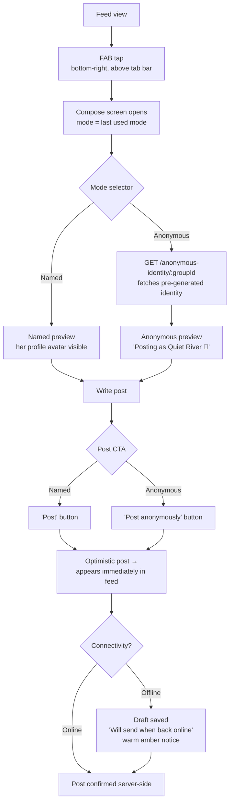
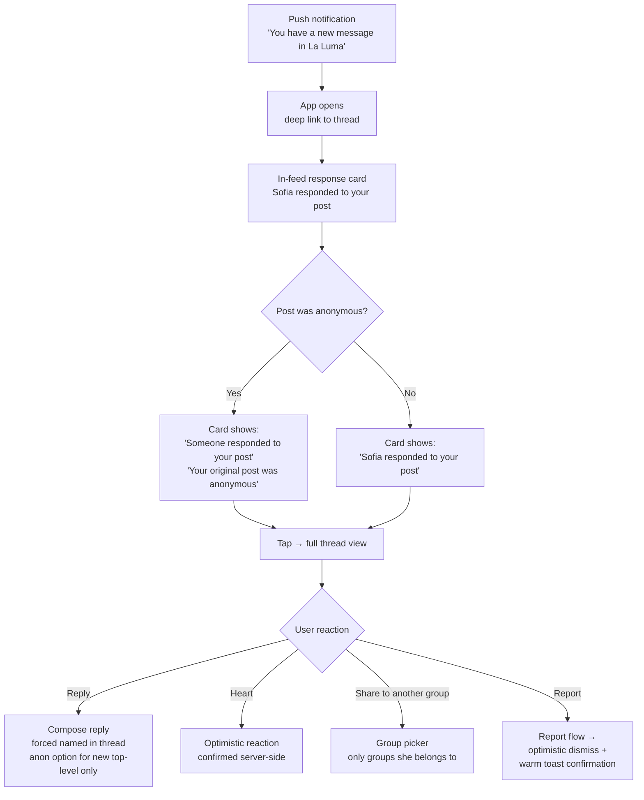
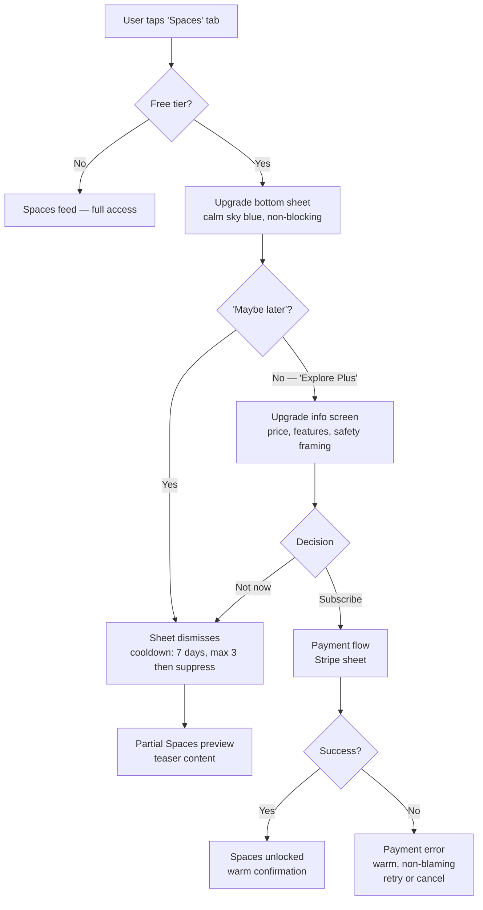

# UX Design Specification — La Luma

**Author:** Duma  
**Date:** 2026-03-03

---

<!-- UX design content will be appended sequentially through collaborative workflow steps -->

## Executive Summary

### Project Vision

La Luma is a safe, beautiful community platform for single mothers — a private sanctuary where vulnerable women share real experiences without fear of judgment, exploitation, or exposure. The UX must make safety *feel* true at every interaction, not just technically enforced.

### Target Users

- **Nadia** (primary) — single mother, 28–42, smartphone-first, moderate tech literacy, cautious first-time user who needs trust before engagement
- **Community Moderator** — trusted trained community member; needs fast, clear decisioning tools
- **Editorial Team / Brand Partner** — internal staff and external partners; desktop-likely workflow

### Key Design Challenges

1. **Trust before engagement** — every first-touch element must earn trust before asking anything
2. **Anonymous posting without friction** — clearly distinct from named posting; never feels "lesser"
3. **Trauma-informed error/empty/loading states** — every state designed for fragile emotional context
4. **Two moderation UX paradigms** — safety moderation (fast, trauma-aware) vs editorial review (considered, brand-alignment); entirely different designs
5. **Mobile-first, one-handed** — used on phones in private moments; desktop secondary
6. **Notification privacy at OS level** — lock screen previews must never reveal group names, message content, or anonymous membership; default: *"You have a new message in La Luma."*
7. **Subscription tier UX** — feature gates non-shaming; upgrade prompts warm and contextual; free-tier users never penalised

### Design Opportunities

1. **Onboarding as a trust ritual** — the first 5 minutes can be a brand signature
2. **Emotional design language** — warm and considered, not clinical; La Luma has an opportunity to feel beautiful without compromising safety messaging
3. **Anonymous identity as beautiful UX** — server-generated avatars and display names become a distinctive, desirable feature

### Architecture Constraint

Anonymous identity is **server-side generated only**. The frontend receives a pre-built anonymous avatar and display name from the API — the client never knows who the anonymous user is. UX design for anonymous posting must work within this constraint. No client-side avatar pickers that map back to real identity.

---

## Core User Experience

### Defining Experience

**Core action:** Safe posting — named or anonymous — into a verified community group. Maximum 3 taps for a named post; 4 taps for an anonymous post.

**Must be effortless:** Landing in the feed · posting · understanding the server-generated anonymous avatar · dismissing distressing content in one gesture · reporting in one tap

**Must never require thought:** Whether she is in a safe space · how to report · how to exit

### Platform Strategy

- **Primary:** iOS + Android via Capacitor — touch-first
- **Secondary:** Mobile web — same React SPA, gracefully degraded
- **Tertiary:** Desktop browser — editorial team + brand partners only
- **Offline:** Feed + community content cached by React Query for read; **anonymous identity data and moderation data explicitly excluded from all local cache — never stored on device**
- **Posting requires connectivity** — communicated with calm, non-alarming messaging

### Critical Success Moments

1. **Trust moment (onboarding, minute 3)** — Nadia reads the privacy explanation and feels held, not processed
2. **First anonymous post** — feels distinct, safe, beautiful; not like hiding
3. **First meaningful response** — notification arrives without revealing content; opening the app to see it is the aha moment
4. **The crisis moment** — she reports distressing content; **optimistic UI dismisses it immediately**; moderation queue processes asynchronously; she trusts the platform more, not less

### Experience Principles

1. **Safety is felt, not just enforced** — legal/technical safeguards translate into sensory cues at every interaction
2. **One step at a time** — one primary action per screen; no compound decisions
3. **Anonymity is beautiful, not shameful** — anonymous mode is a feature to celebrate
4. **Silence is safer than confusion** — when in doubt, show less; empty states are calm, not alarming
5. **Errors are the platform's fault** — never blame the user; always warm, always offer a way forward
6. **Recovery is always possible** — no destructive action irreversible without undo or confirmation; no session terminates unexpectedly

---

## Desired Emotional Response

**Primary feeling: *Held.*** The interface communicates without words: *"You are welcome here exactly as you are. Nothing you share here can hurt you."*

**Secondary feelings:** Calm confidence · Quiet belonging · Gentle pride

### Emotional Journey

| Moment | Desired | Avoided |
|---|---|---|
| First discovery | Curiosity, warmth | Overwhelm, suspicion |
| Onboarding | Trust forming, relief | Data-extraction anxiety |
| Joining group | Cautious excitement | Exposure anxiety |
| Named post | Brave, supported | Exposed, judged |
| Anonymous post | Safe, liberated | Stigmatised |
| Receiving response | Seen, connected | Re-vulnerable |
| Reporting | Empowered | Helpless, re-traumatised |
| Feature gate | Warmly invited | Shamed |
| Error | Reassured, cared for | Blamed, abandoned |
| Returning day 2+ | At home, picked up where she left off | Starting over, re-explaining |

**Persistent remembered state:** No re-onboarding on return visits; React Query cache + Keycloak session continuity ensures Nadia lands in her feed, not in a welcome flow.

### Emotional Register

- **Calm** — default register for feed, community, profile
- **Warm anticipation** — only in events/discovery context (Luma Spaces, milestones, curated partner offers)
- **Belonging** — even reading without posting feels like membership
- **Delight** — tiny moments: anonymous avatar reveal, content warning design, loading animation

### Design Implications

| Emotion | UX approach |
|---|---|
| Held / warmth | Rounded corners · soft palette · generous whitespace |
| Calm confidence | Consistent layouts · no unexpected state changes |
| Quiet belonging | Group presence indicators — not vanity metrics |
| Liberation (anon) | Distinct visual celebration, not a disclaimer |
| Empowerment (report) | One gesture → optimistic dismiss → "Thank you for keeping this space safe" |
| Care (errors) | Human voice · no technical language · always a next step |

### Emotions to Actively Avoid

- **Shame** — free-tier gates, posting regret, report outcomes
- **Anxiety** — notifications, permission requests, data notices
- **Confusion** — if she doesn't know what happens next, we failed
- **Re-traumatisation** — content warnings and crisis moments handled with extreme care
- **Urgency** — no artificial pressure; no countdowns; no "X people waiting for you"; unread counts shown calmly, never as demands

---

## UX Pattern Analysis & Inspiration

### Inspiring Products

| Reference | What to learn | Pattern |
|---|---|---|
| **Calm** | Stillness as interface | Low-stimulation baseline; warmth through typography + space, not animation |
| **Signal** | Privacy as care | Privacy cues embedded in design, not bolted on as warning text |
| **Headspace** | Values-first onboarding | Trust ritual before feature tour; illustrated; no "skip" on trust-building steps |
| **Geneva** | Community structure | Group hierarchy + feed respecting attention; adapt with La Luma safety trust signals |
| **Superhuman** | Ruthless simplicity | Every interaction eliminates cognitive load; one gesture for anything possible; confirmation dialogs only for irreversible high-stakes actions |

### Transferable Patterns

**Navigation:** Bottom tab bar (thumb-reachable) · home tab = immediate feed · no landing page  
**Interaction:** Long-press context menu for post actions · swipe-to-dismiss distressing content · optimistic UI for report/like/join · "You've caught up" natural feed stopping point  
**Visual:** Muted warm background · generous vertical spacing · distinct anonymous post card treatment

### Anti-Patterns to Avoid

- **Infinite scroll without pause** — add natural stopping points
- **Red notification badges** — soft/muted indicators only
- **Modal interruptions mid-flow** — never block an action to ask something
- **Passive identity surfacing via search** — only users who explicitly enabled discoverability are searchable; default: not discoverable
- **Auto-play/animated content by default** — motion sensitivity; off by default
- **"People you may know"** — discovery is strictly opt-in only

### Design Inspiration Strategy

| | Products / Patterns |
|---|---|
| **Adopt** | Calm's stillness · Signal's privacy-as-care · Headspace's values-first onboarding · Superhuman's one-gesture philosophy |
| **Adapt** | Geneva's group hierarchy → add La Luma safety trust indicators |
| **Invent** | Subscription upgrade UX — no existing reference; design principle: *upgrade = discovering a bonus, not hitting a wall* |
| **Avoid** | Twitter's urgency · Facebook's passive discovery · Reddit's voting mechanics · Unbounded infinite scroll |

---

## Design System Foundation

### Choice: Custom component library — Radix UI + CSS Modules + CSS custom properties

*No Material Design. No Ant Design. No Chakra UI.*

### Implementation Layers

**Layer 1 — Design Tokens (`tokens.css`, `:root` scope)**

All tokens are **semantic (purpose-based), never descriptive (colour-based):**
- `--color-anon-bg` not `--color-warm-beige`
- `--color-safety-accent` not `--color-red`
- `--color-upgrade-surface` not `--color-amber`

Token categories: colour palette · typography scale · spacing scale · border radii · shadow system

**Layer 2 — Radix UI primitives (unstyled, WCAG 2.1 AA accessible)**

Dialog · Popover · DropdownMenu · Toast · Switch — ARIA-correct out of the box; styled entirely via Layer 1 tokens

**Layer 3 — La Luma custom components (CSS Modules scoped)**

Each component: own `.module.css` · no class name collisions · co-located with component

Core custom: `AnonymousPostCard` · `ContentWarning` · `TrustBadge` · `SafetyCallout` · `UpgradeInvite`

### Typography

**DM Sans** (Google Fonts) — humanist, warm, excellent mobile legibility, generous x-height; free/open source

### Customisation Strategy

| Mode | Implementation |
|---|---|
| Anonymous mode | `--color-anon-bg` token on card — distinct, celebratory |
| Dark mode | CSS class on `<html>`; all tokens flip via `prefers-color-scheme` |
| High contrast | AAA-compliant token set for accessibility setting |
| Upgrade prompts | `--color-upgrade-*` token family — warm, never alarming |

---

## Core Defining Experience

> **"Post safely — named or anonymous — and be received with care."**

Everything in La Luma serves this moment.

### The Post Flow

**1. Initiation:** FAB bottom-right, 24dp above tab bar; accessibility setting mirrors to bottom-left for left-hand dominant users

**2. Compose & mode selection:**
- Mode selector prominent at top of compose view
- **Named:** profile avatar visible in compose preview
- **Anonymous:** client calls `GET /anonymous-identity/:groupId` on toggle → anonymous avatar + name pre-fetched and revealed in compose preview before posting

**3. Anonymous identity:**
- Names follow **[Warm Adjective + Nature Noun]** pattern: *"Quiet River"*, *"Gentle Fern"*, *"Silver Dawn"*
- Warm, non-identifying, non-stigmatising; curated word lists exclude negative combinations
- Micro-copy: *"Posting as Quiet River 🌿"* vs. *"Posting as Nadia"*

**4. Mode toggle:** single tap; visual state change dramatic and unambiguous; impossible to post in wrong mode accidentally

**5. Post → Feed:** optimistic UI → instant appearance; anonymous posts use `--color-anon-bg` card treatment

### Novel Patterns to Design

| Element | Why novel | Design challenge |
|---|---|---|
| Named/anonymous mode toggle | No standard pattern | Intuitive without tutorial |
| Anonymous avatar reveal | Server-generated, pre-fetched | Most delightful moment in the app |
| Anonymous post card | Distinct but celebrated | Not a disclaimer; a signature |

---

## Visual Design Foundation

### Colour System

| Token | Light | Dark | Purpose |
|---|---|---|---|
| `--color-surface` | `hsl(30, 15%, 97%)` | `hsl(240, 8%, 12%)` | Page background |
| `--color-surface-raised` | `hsl(30, 12%, 93%)` | `hsl(240, 7%, 17%)` | Card background |
| `--color-text-primary` | `hsl(240, 8%, 18%)` | `hsl(30, 15%, 92%)` | Body text |
| `--color-text-secondary` | `hsl(240, 5%, 45%)` | `hsl(240, 5%, 65%)` | Supporting text |
| `--color-safety-accent` | `hsl(255, 35%, 38%)` | `hsl(255, 40%, 60%)` | Primary actions — deep plum |
| `--color-anon-bg` | `hsl(38, 55%, 92%)` | `hsl(38, 30%, 22%)` | Anonymous post card |
| `--color-upgrade-surface` | `hsl(200, 40%, 94%)` | `hsl(200, 25%, 20%)` | Upgrade invite — calm sky |
| `--color-success` | `hsl(150, 35%, 42%)` | `hsl(150, 35%, 55%)` | Success states |
| `--color-danger` | `hsl(355, 50%, 48%)` | `hsl(355, 50%, 62%)` | Error states |

**Dark mode:** `prefers-color-scheme: dark` swaps entire `:root` block — same semantic token names; no component code changes needed

**Upgrade surface rationale:** `hsl(200, 40%, 94%)` deliberately distinct from safety accent (deep plum) — prevents subconscious conflation of commercial prompt with safety signal; this distinction must be maintained in all future palette revisions

**Accessibility:** All text/background pairings minimum WCAG AA (4.5:1)

### Typography

**DM Sans** (Google Fonts, free) — weights 400, 500, 600

| Scale | Size | Weight | Usage |
|---|---|---|---|
| `--text-2xl` | 24px | 600 | Screen titles |
| `--text-xl` | 20px | 600 | Section headers |
| `--text-lg` | 18px | 500 | Card titles |
| `--text-base` | 16px | 400 | Body, post content |
| `--text-sm` | 14px | 400 | Supporting text |
| `--text-xs` | 12px | 400 | Timestamps, labels |

Line height: 1.5× body · 1.2× headings · Letter spacing: -0.01em headings

### Spacing & Layout

Base: 4px · Scale: 4 · 8 · 12 · 16 · 24 · 32 · 48 · 64  
Cards: 12px radius · Buttons: 8px · Inputs: 8px · Minimum tap target: 44×44px  
Shadow: `0 2px 8px hsla(240, 10%, 10%, 0.08)`

### Accessibility Baseline

- `prefers-reduced-motion` → all animations off; transitions instant
- `prefers-contrast: high` → AAA token set activates
- **Focus ring:** `2px solid var(--color-safety-accent)` with `2px offset` — `outline: none` never used without replacement

---

## Design Direction Decision

**Single unified direction** — one coherent visual system expressed across all screens.

> *Warm, calm, held. Deep plum safety. Gold anonymous. Sky upgrade. Human voice throughout.*

### Design Screens Confirmed

| Screen | Key design decision |
|---|---|
| Feed | Warm neutrals; anon posts gold; "caught up" calm state; no red badges |
| Compose | Mode toggle top of screen; anon avatar revealed before posting; button copy per mode |
| Onboarding | Trust ritual on safety plum; four concrete promises; no skip on privacy |
| Group | Trust bar persistent in header; consent-first content warning card |
| Upgrade | Calm sky bottom sheet; "Maybe later" always visible; no urgency language |
| Safety | Optimistic report; "Thank you for keeping this space safe" warm toast |
| Notification | OS lock screen always "You have a new message in La Luma" — no exceptions |
| Error | "This is on us, not you"; draft auto-saved offline; warm amber not red |
| Inbox | Anonymous-safe response threading; in-feed aha moment card |

### Additional Specifications

**Group join flow** — follows onboarding trust ritual pattern: verified status + group rules shown prominently + "Request to join" CTA; moderator approval gated; never instant join

**Crisis support placement** — You tab → Help & Safety; never surfaced in feed, notification layer, or post flow; accessible but never intrusive

### HTML Showcase

Full interactive showcase: `_bmad-output/planning-artifacts/ux-design-directions.html` — 9 screens with design rationale per screen

---

## User Journey Flows

### Journey 1: First-Time Onboarding

### Journey 2: Safe Posting — Named or Anonymous

*Note: Anonymous identity is deterministic per user+group within a session. UX always displays the returned identity on each toggle; never assumes unchanged.*

### Journey 3: Receiving First Meaningful Response

### Journey 4: Discovering an Upgrade Prompt

### Journey Patterns
| Pattern | Description |
|---|---|
| **Optimistic first** | Posts, reactions, reports appear immediately; server confirmation async |
| **Warm recovery** | Every error has a next step; copy never blames user; amber not red |
| **Mode persistence** | Last-used compose mode remembered; explicit toggle required to change |
| **Anonymous isolation** | Identity pre-fetched on toggle; deterministic within session; never in notifications |
| **Non-blocking upgrade** | Dismissable always; 7-day cooldown; max 3 then permanent suppress |
| **Deep link to moment** | Notifications always deep-link to the specific thread, never home |

---

## Component Strategy

### 1. Foundation Components (Radix UI)
We will use Radix UI unstyled primitives for complex interactive components to guarantee accessibility (ARIA, focus management, keyboard navigation) without fighting overriding styles.

| Component | Radix Primitive | Styling notes |
|---|---|---|
| **Bottom Sheet** | `Dialog` | Used for Upgrade invite. Focus trapped. |
| **Dropdown Menus** | `DropdownMenu` | Used for "Share/Report" actions on posts. |
| **Tabs** | `Tabs` | Main bottom navigation bar. |
| **Toast** | `Toast` | Used for safe/optimistic reporting feedback (`--color-success`). |
| **Modal** | `Dialog` | Only used for absolute blockers (e.g. fatal errors); we prefer inline cards. |

### 2. Custom Components (La Luma Core)
These are the bespoke components that define the La Luma experience, built from HTML/CSS Modules utilizing our semantic design tokens.

#### A. The Post Card
**Purpose:** Displays named or anonymous content in the feed.
**Variants:**
- `isAnonymous={true}`: Applies `--color-anon-bg` and gold ring to avatar.
- `hasWarning={true}`: Hides content behind a consent-first overlay.
**States:**
- `isPending={true}`: Supports the optimistic UI pattern. Drops opacity while awaiting server confirmation. Local fallback to error state wrapper on failure.
**Accessibility:** Entire card is not a button; semantic `<article>` with interactive children.

#### B. The Content Warning Block
**Purpose:** Protective layer over potentially triggering content.
**States:**
- `Hidden`: Shows custom warning text + "Show post" / "Report" buttons.
- `Revealed`: Shows content but keeps warning header visible.
**Design:** Uses `--color-surface-raised` with a `--color-danger` left-border indicator.

#### C. The Compose Mode Toggle
**Purpose:** Top-of-screen toggle switching between Named and Anonymous modes.
**Behavior:**
- Generates/fetches anonymous identity on first toggle.
- Warns user if attempting to change mode *after* typing content.
- **Animation:** Requires a deliberate, smooth animation minimum of 300ms to physically reinforce the identity shift. No instant flashing.
**Aria:** standard `role="radiogroup"` behavior.

#### D. The Safety Trust Bar
**Purpose:** Persistent indicator in Group Views showing safety measures.
**Content:** Pills for "Moderated", "Private", "Verified".
**Design:** High-contrast, un-dismissible.

#### E. Upgrade Bottom Sheet Wrapper
**Purpose:** Renders the sky-blue upgrade invite.
**API:** Must accept dynamic config props (`price`, `features`) to support future A/B testing of business logic. Not a hardcoded component.

### 3. Implementation Roadmap

**Phase 1 — Core Interactions (Week 1)**
- Post Card (Named, Anonymous, & `isPending` variants)
- Compose Mode Toggle
- Radix Tabs implementation

**Phase 2 — Safety Layer (Week 2)**
- Content Warning Block
- Radix Toast (Reporting feedback)
- Trust Bar

**Phase 3 — Business & Polish (Week 3)**
- Upgrade Bottom Sheet (Dynamic Prop wrapper around Radix Dialog)
- Onboarding Trust Ritual steps
- Native-like transitions

---

## UX Consistency Patterns

### 1. Button Hierarchy
*Action priority is essential for calm navigation without visual clutter.*

**Primary Action (Submit, Post, Upgrade)**
- **Visual:** Solid fill (`--color-safety-accent` or `--color-upgrade-accent`). White text. Large tap target (min 44px height).
- **Behavior:** Usually one per page. Always triggers a state change.

**Secondary Action (Cancel, Save Draft, Close)**
- **Visual:** Light gray background (`--color-surface-overlay`). Slate text (`--color-text-secondary`). No border.
- **Behavior:** Non-destructive alternative to the primary action.

**Tertiary Action (Skip, Learn More)**
- **Visual:** Text only, standard weight, colored with `--color-text-muted`. Underline on hover.
- **Behavior:** Low priority escapes, always positioned below the main CTA row.

**Destructive Action (Delete Account vs. Report)**
- **User-Impact (Delete Account/Leave Group):** Solid or outlined with `--color-danger`. ALWAYS requires a secondary confirmation modal or double-tap logic. Never optimistic.
- **Community-Impact (Report Post/Block User):** Optimistic UI pattern (immediate hide + success toast) to minimize friction for safety.

### 2. Feedback Patterns
*How the app responds to user input — prioritizing calm over alarm.*

**Success Feedback (Reporting, Saving)**
- **Visual:** In-line card (Optimistic UI) or a non-blocking Radix Toast at the top of the screen. Light green background.
- **Copy Rule:** Human and appreciative. ("Thank you for keeping this space safe.")

**Warning / Offline Feedback**
- **Visual:** Warm amber background. Not red.
- **Copy Rule:** State the issue, but assure safety. ("No connection. Your draft is saved.")
- **Offline Sync Recovery:** When app reconnects and pushes background changes, do not throw a blocking success modal. Use standard green Toast ("Your draft was posted") and silently refresh the feed.

**Fatal Error**
- **Visual:** Full empty state page takeover (to prevent interaction with broken partial states).
- **Copy Rule:** Platform takes the blame. ("This is on us, not you.") Always includes a "Try again" primary button.

### 3. Form & Loading Patterns
*Managing async states and data entry without blocking or confusing.*

**Progressive Disclosure**
- **Rule:** Never show a 10-field form. Ask one logical grouping at a time (e.g., Phone → Verification → Privacy Promise).

**Validation States**
- **Rule:** Validate on `blur` (when she leaves the field), not on `change` (while she is typing).

**Async Loading State**
- **Rule:** Asynchronous operations (like identity checks) must show a localized loading spinner *inside* the input field or button, never taking over the full screen for minor checks.

**Skeleton Loading**
- **Rule:** When data is fetching (e.g., Feed, Inbox), use subtle, pulsing gray shapes (skeleton screens) that match the dimensions of the expected content. No generic spinning wheels in the center of a blank page.

### 4. Navigation & Escaping
*Ensuring the user never feels trapped.*

**Feature Gating Pattern**
- **Rule:** When a free user interacts with a premium feature (like tapping a 'Private Space'), the interaction triggers the standard Upgrade Bottom Sheet, never an 'Access Denied' error. It's an invitation, not a wall.

**The "Maybe Later" Constant**
- **Rule:** Every promotional, non-essential, or upgrade flow must have a visible "Maybe later" or "Skip" action. It must never be hidden via scrolling.

**Gestural Escapes (Mobile)**
- **Rule:** All Bottom Sheets must be dismissible by a downward swipe gesture, not just a close button.

### 5. Content Discovery (Empty States)
*Empty spaces should feel like clean rooms, not errors.*

**"Caught Up" State**
- **Rule:** When a feed is exhausted, display the "Caught Up" illustration. Do not loop back to old posts. Validate her completion so she can close the app without FOMO.

**First-Time Empty State**
- **Rule:** If a space or group is empty, do not say "Nothing here." Prompt action: "Say hello to your new community."

**Zero-Result Search State**
- **Rule:** Never a dead end. If a search yields 0 results, provide a clear primary action: "Ask the community" (opens compose pre-filled with the search term) or "Browse topics".

---

## Responsive Design & Accessibility

### Responsive Strategy
**Mobile-First Everything**
- 85%+ of our expected organic traffic and all app usage will be mobile. The design is conceived for a 390px width and scales *up*.
- **Mobile:** Bottom tab navigation. Native-like gestural escapes (swipe down to dismiss sheets).
- **Tablet/Desktop:** We will NOT stretch the feed to full width. We use a **"Pillar Layout"**. The main feed remains constrained to a 600px max-width column centered on the screen. Left rail becomes standard navigation; right rail allocated for persistent group context ("Mamas in Motion" rules/info).

### Breakpoint Strategy
We will use standard Tailwind/CSS-module friendly breakpoints, but with strict max-widths for reading comfort.

- **Mobile (Default):** 0px – 767px (Bottom Tab Navigation)
- **Tablet:** 768px – 1023px (Side Navigation appears, feed stays centered)
- **Desktop:** 1024px+ (Side Navigation + Right Context Rail)

### Accessibility Strategy
**Target Compliance:** WCAG 2.2 AA (Strict)

1. **Trauma-Informed Contrast:** 
   We must pass AA (4.5:1) for text, but we must do so using our muted "calm" palette, avoiding harsh pure blacks (`#000000`) or blaring reds (`#FF0000`).
2. **First-Class Dark Mode:**
   Dark mode is not an afterthought; it must maintain the exact same WCAG 2.2 AA contrast ratios as light mode, specifically ensuring semantic colors like `--color-anon-bg` (gold) remain legible.
3. **Reduced Motion (`prefers-reduced-motion`):**
   If the user OS requests reduced motion, ALL 300ms transition animations degrade to 0ms instant swaps. No compromises.
4. **Keyboard & Focus:**
   For desktop users, every interactive element must have a visible `2px` offset focus ring in `--color-safety-accent` (Plum). We NEVER use `outline: none` without a visual replacement.
5. **Screen Reader Safety & Content Warnings:**
   If a post is behind a Content Warning Block, the hidden content MUST have `aria-hidden='true'` so screen readers do not spontaneously read triggering text before explicit user consent.
6. **Fluid Typography:** 
   Do not use hardcoded pixel values for fonts. Use CSS `clamp()` functions mapping to `rem` units so text scales gracefully without breaking layout if a user increases OS default font size to 200%.
7. **Touch Targets:**
   Minimum interactive area on mobile must be `44x44px`. Small text links must have padded hit areas.

### Testing Strategy
- **Automated:** Axe-core integrated into the CI/CD pipeline blocking PRs on WCAG AA failures.
- **Manual (Mobile):** iOS VoiceOver and Android TalkBack testing must be performed on the core compose/reply flows before any release.
- **Visual:** Percy or Chromatic for visual regression testing across the 3 breakpoints.

### Implementation Guidelines
- **Semantic HTML:** Use `<article>` for posts, `<nav>` for menus, `<dialog>` for bottom sheets. Div soup breaks screen readers.
- **Radix UI:** Our reliance on Radix UI gives us out-of-the-box ARIA compliance for complex components. Do not rebuild these from scratch.
- **Font Scaling:** Use `rem` units for all typography to respect the user's OS-level text size preferences. Never lock font sizes in `px`.
